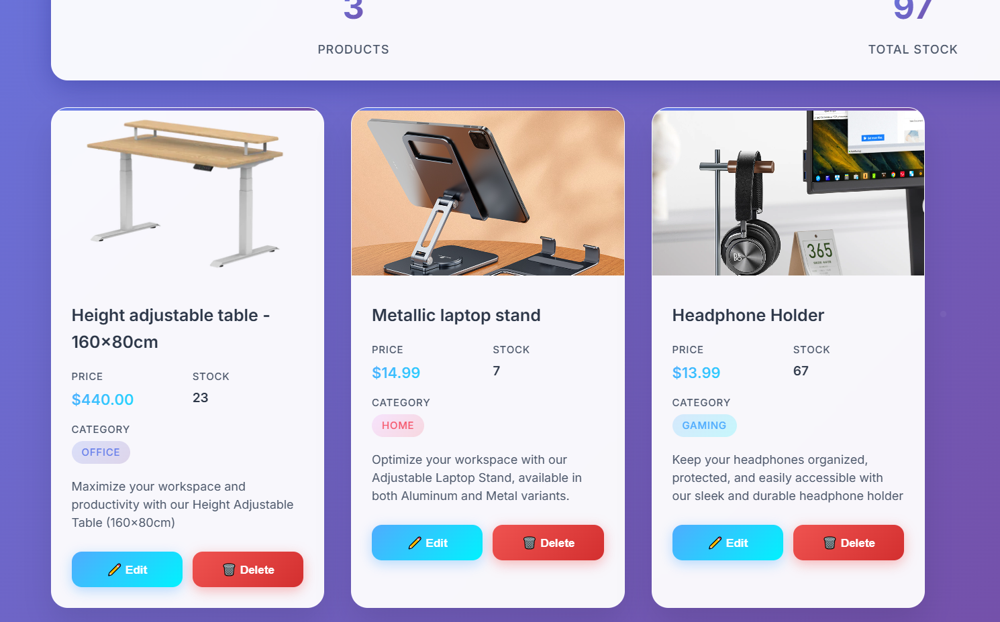

# Furnitech Full-Stack Project

A complete web application for Furnitech, a smart furniture company. The system includes:

- `admin/`: Admin app for managing products.
- `client/`: Client app for browsing and purchasing products.

---
## 📸 Screenshots
### 📦 Admin Login


### 🏠 Admin App - Home Page


### 🧑‍💼 Admin Portal - Product Management


### 🧑‍💼 Client - Home


## 🛠 Tech Stack

### Admin Portal:
- Spring Boot
- Spring MVC
- Spring Data JPA
- MySQL
- Thymeleaf
- jQuery

### Client Storefront:
- Spring Boot
- Spring MVC
- Spring Data JPA
- MySQL
- Thymeleaf
- jQuery

---

## 🚀 How to Run

### Prerequisites:
- Java 17+
- MySQL
- Gradle or IntelliJ (with Gradle support)

### Database Setup:
Create a MySQL database named `furnitech_db`.


---

### Admin:

```bash
cd admin-portal
./gradlew bootRun
# Runs at http://localhost:8081

### Client:
cd client
./gradlew bootRun
# Runs at http://localhost:8080


